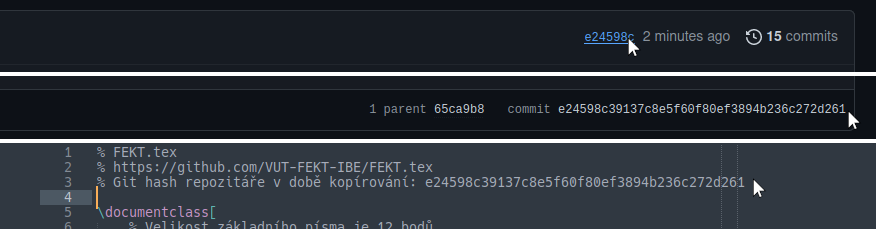

# MPC-TLS

Otázky a odpovědi na Telekomunikační systémy.

1. Vysvětlete pojem konvergované telekomunikace, resp. konvergence telekomunikačních sítí.
2. Vysvětlete pojmy Transwitch, Softswitch+Media gateway. Uveďte některé představitele či platformy, odlišnosti a oblast využití.
3. Porovnejte výhody a nevýhody použití Open Source ústředen a proprietárních ústředen, tj. ústředen tradičních výrobců. Uveďte a odůvodněte nejčastější aplikace.
4. Co je to DID a DISA? Vysvětlete na příkladu PBX v síti s pevným číslovacím plánem. Který typ byste očekávali u menších a který u větších PBX?
5. Co je to šetřící automat LCR (ARS)? Vysvětlete funkci. Načrtněte obrázek funkce některé z implementací šetřícího automatu. Co je to normalizace?
6. Vysvětlete princip směrování hovorů v PBX Asterisk. K čemu slouží kontexty? Uveďte jednoduchý příklad s pomocí souboru rozhraní a volacího (směrovacího) plánu.
7. Charakterizujte Open Source PBX. Pro které aplikace je nutno doplnit specifický HW? Uveďte některé výrobce specifického HW pro Open Source PBX.
8. Architektura PBX Asterisk. Uveďte základní čtyři API rozhraní a jejich využití. K čemu slouží Dynamic Module Loader, Codec Translator, Application Launcher?
9. Uveďte příklady alternativních Open Source PBX k PBX Asterisk a porovnejte je.
10. Instalace Open Source PBX. Porovnejte výhody a nevýhody instalace z balíčků a instalaci ze zkompilovaných zdrojových souborů. Kdy se pro druhou z nich rozhodnete?
11. Uveďte možnosti připojení PBX do veřejné sítě. U jednotlivých příkladů rozhraní uveďte i názvy použitých signalizací.
12. Vyjmenujte sedm základních funkcí analogové účastnické sady a stručně je vysvětlete. Jak jsou v zahraniční literatuře označeny a-drát a b-drát?
13. Funkce účastnické sady: Jakým způsobem je napájen analogový telefon? Specifikujte parametry a typ zdroje.
14. Funkce účastnické sady: Vysvětlete funkce analogové účastnické sady vyzvánění, dohlížení a testování. Dle specifické funkce uveďte parametry úrovní a tvaru signálů, časové parametry.
15. Funkce účastnické sady: Vysvětlete funkce analogové účastnické sady kódování a vidlicovou funkci. Pro které generace ústředen jsou tyto funkce vyžadovány?
16. Vysvětlete signalizaci na analogovém účastnickém rozhraní POTS pro stav „volání“. Uveďte reprezentaci jednotlivých signálů a jejich parametry. Jedná se o celosvětově standardní signalizaci nebo se v jednotlivých zemích liší?
17. Jaké hardwarové karty pro Open Source PBX jsou dnes nabízeny?
18. Jaké jsou základní prvky signalizační sítě SS7? Vysvětlete jejich funkci.
19. Jakým způsobem je řešena adresace v síti SS7. Vysvětlete význam pojmu národní síť, národní rezerva (přechodová síť), mezinárodní síť, mezinárodní rezerva? Zakreslete obrázek využití jednotlivých sítí v ČR.
20. SS7: Uveďte základní tři typy zpráv (SU) přenášených na 2. vrstvě. K čemu slouží?
21. SS7: Jakým způsobem je identifikováno v signalizací SS7-ISUP, která může probíhat i v zcela jiném rámci E1 než vlastní hovor, ke kterému time-slotu a E1 tato signalizace přísluší.
22. SS7: Uveďte sled zprávy, které se přenáší na vrstvě ISUP při budování hovorového spojení.
23. SS7: Uveďte, ve kterých Open Source PBX a jak lze implementovat SS7. Rovněž u každého příkladu uveďte, které prvky signalizační sítě SS7 jsou implementovány.
24. Uveďte standardizované signalizační VoIP protokoly a oblast využití.
25. K čemu slouží protokoly pro správu multimediální relace, co je v nich přenášeno, co je pomocí nich „vyjednáváno“. Uveďte protokoly pro správu multimediální relace využívané v SIP, MGCP, H.323 a IAX.
26. Protokol SIP: Popište průběh spojení. Co zajišťuje SDP protokol a kde se přenáší. Jaký je jeho ekvivalent v H.323 protokolu.
27. Protokol SIP: Vysvětlete odlišnosti v implementaci SIP proxy a B2BUA (Back to Back User Agent). Zakreslete obrázky. Která z uvedených metod je uplatněna v PBX Asterisk a jaké jsou její výhody?
28. Vysvětlete rozdíl účtů user, peer a friend v PBX Asterisk. Zakreslete model autentizace hovoru v PBX Asterisk.
29. Protokol IAX: Popište protokol IAX. Uveďte dva typy rámců, a kdy se který z nich využívá. Popište odlišnosti oproti protokolům SIP a H.323. Uveďte sled zpráv přenášených při budování spojení.
30. Popište signalizační protokol MGCP. Uveďte oblast jeho využití. Uveďte zprávy (příkazy) používané při vytváření spojení.
31. Uveďte alespoň některé proprietární signalizační VoIP protokoly a oblast využití.
32. K čemu slouží skupina protokolů SIGTRAN? Nakreslete vazbu TDM a IP sítě s využitím protokolu SIGRAN.
33. Jaké jsou možnosti přenosu DTMF tónů ve VoIP telefonii. Uveďte příklady aplikací, kdy je nutno přenášet DTMF?
34. Co je to NAT? Vysvětlete problematiku NAT a problematiku SIP klienta v podsíti. Vysvětlete funkci protokolu STUN. Pro který typ NATu jej nelze použít a proč? Jaké znáte další možnosti „překonání“ NAT? Jak je řešen tento problém v PBX Asterisk?
35. QoS ve VoIP: Jaké jsou základní tři metody hodnocení kvality hovoru? Co je to MOS a jakých hodnot může nabývat? Co je to R-faktor? Uveďte i některé konkrétní metody.
36. Uveďte některé zvukové kodeky. Je použití některých kodeků licencováno? Uveďte některé z nich. Které kodeky jsou standardně implementovány v HW koncových zařízeních a PBX tradičních výrobců.
37. QoS ve VoIP: Jak souvisí zpoždění paketů s ozvěnou (echem)? Jaké zpoždění signálu bylo v TDM sítích a jaké je cca. v paketových sítích?
38. QoS ve VoIP: Jakými způsoby je možno zajistit QoS ve VoIP telefonii? Je podpora některé z metod zajištění QoS ve VoIP zařízeních téměř standardně implementována? Vysvětlete pojmy DSCP, třída EF (Expedited Forwarding), VoIP VLAN (IEEE 802.1p).
39. Bezpečnost IP telefonie: Jaké znáte typy útoků na telefonní provoz v IP síti. Uveďte alespoň některá opatření k zajištění bezpečnosti VoIP telefonie.
40. Bezpečnost IP telefonie: Jaké znáte možnosti a protokoly realizace šifrovaného přenosu VoIP telefonie (signalizace i „hlasu“)? Uveďte důvody, proč se zatím v širší míře neuplatňují.
41. Vysvětlete pojmy zjevný, skrytý, otevřený a uzavřený číslovací plán.
42. Vysvětlete pojem omezení oprávnění v PBX. Jak je implementováno v tradičních PBX a jak je lze implementovat v PBX Asterisk.
43. Vysvětlete pojmy výlučné a obecné přidržení hovoru. Jak je tato funkce implementována v PBX Asterisk? Vysvětlete pojmem převzetí hovoru.
44. Popište princip automatické distribuce hovorů. Nakreslete obrázek a uveďte jak je tato služba implementována v PBX Asterisk
45. Co je to Interaktivní hlasová odezva (IVR)? Vysvětlete princip implementace v PBX Asterisk.
46. Uveďte a popište druhy obsluhových systémů z hlediska možnosti vytváření front.
47. Co znamená jednotka 1 erl, čeho je to jednotka?
48. Pro jaký obsluhový systém platí první erlangova rovnice a co vyjadřuje.
49. Vysvětlete, jak lze využít první erlangovu rovnici pro dimenzování šířky pásma pro VoIP telefonii či dimenzování počtu licencí transkodérů.
50. Pro jaký obsluhový systém platí druhá erlangova rovnice a co vyjadřuje?

---

Odpovědi na otázky byly vypracovány pouze pro studíjní účely

Zdroje:

- Šilhavý, P. Telekomunikační a informační systémy. VUT v Brně, 2014. ISBN: 978-80-214-5027-1
- Bryant, R, Madsen, L., Meggelen, J.V. Asterisk™. The Definitive Guide. 4th ed. Sevastopol: O’Reilly Media, Inc., 2013. ISBN: 978-1-449-33242-6
- Madsen, L., Bryant, R..Asterisk Cookbook. O’Reilly Media, Inc., 2011. ISBN: 978-1-449-30382-2
- dále zápisky z přednášek MPC-TLS

# FEKT.tex

LaTeX šablona pro sazbu studijních materiálů vytvořených studenty k přípravě na zkoušky.
Dokument obsahuje základní nastavení a představení různých funkcí.

## Použití

Nejjednodušší je stáhnout tento repozitář jako zip a nahrát jej do online LaTeX compileru [Overleaf](https://overleaf.com).

## GitHub releases

S pomocí GitHub Actions je nyní možné používat GitHub release na vydání nové verze pdf.
Stačí pouze nový commit v `main` větvi a GitHub Actions se o build a release postará.
Taktéž máme workflow pro kontrolu příchozích Pull Requestů, který neprojde pokud build selže.
Nejnovější release této šablony můžete vidět [zde](https://github.com/VUT-FEKT-IBE/FEKT.tex/releases/latest).

_Pozn.: Build se týká pouze souboru [`main.tex`](main.tex), proto byste neměli přidávat jiné hlavní .tex soubory._

### Co neupravovat: `shared.tex`

Obsah souboru [`shared.tex`](shared.tex) obsahuje kompletní nastavení stylu dokumentu.
Nikdy jej neupravujte, všechna případná doplnění provádějte v souboru `main.tex`.
V budoucnu tak bude možné vyměnit váš zkopírovaný soubor za novější a nepřijdete tak o žádné změny, které jste provedli.

Pokud zakládáte dlouhodobější projekt, proveďte následující krok:

- Zkopírujte git hash nejnovějšího commitu na GitHubu
- Vložte jej na třetí řádek v `shared.tex`

Takto budete mít lepší přehled o verzi vašeho `shared.tex` a budou se vám lépe kontrolovat aktualizace.

### Co upravovat: `main.tex`

Soubor [`main.tex`](main.tex) pak obsahuje konkrétní nastavení dokumentu.

| Příkaz       | Popis                                           | Příklad                         |
| ------------ | ----------------------------------------------- | ------------------------------- |
| \subject     | Kód předmětu                                    | BPC-SPR                         |
| \subjectname | Název předmětu                                  | Softwarové právo                |
| \authors     | Seznam autorů dokumentu                         | A, B, C                         |
| \corrections | Seznam korektorů gramatiky či oprav formátování | C, A                            |
| \docdesc     | (nepovinný) Popis dokumentu                     | Poznámky k předmětu             |
| \docgroup    | (nepovinný) Cílová skupina dokumentu            | Informační bezpečnost, FEKT VUT |
| \docurl      | (nepovinný) URL repozitáře                      | https://github.com/...          |

Tento soubor si zkopírujte pouze jednou na začátku, k jeho aktualizacím by docházet nemělo.

### Kam psát: `text/`

Kam budete psát samotný text dokumentu je na vás.

Tento repozitář je připravený pro větší dokumenty a obsah se vkládá do `text/01.tex`.
Pro každý nově vytvořený soubor musíte také přidat `\include{}` ve vašem `main.tex`.

Pokud vytváříte menší dokument, může pro vás být přehlednější složku `text/` nepoužívat a vytvořit si nový textový soubor `text.tex` hned v kořenové složce; v tomto případě pak upravte `\include{}` volání ve vašem `main.tex`.

### Rozšíření pro případ více dokumentů

Pokud vytváříte více dokumentů v jednom repozitáři (viz státnicové otázky [bakalářského](https://github.com/VUT-FEKT-IBE/BPC-IBE-SZZ) a [magisterského](https://github.com/VUT-FEKT-IBE/MPC-IBE-SZZ) programu), můžete vytvořit soubor `.repo.tex`, který je načten a zpracován. V něm lze definovat proměnné platné pro celý repozitář a není tak nutné upravovat jednu hodnotu (např. popis dokumentu) ve všech `main` souborech, ale pouze v jednom kořenovém.
